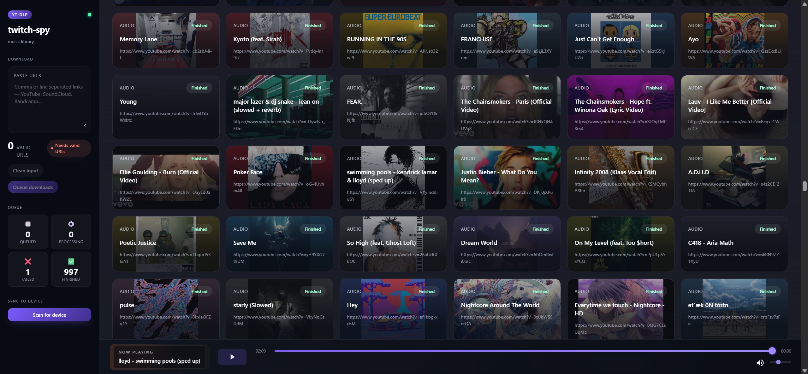

# twitch-spy

A self-hosted music library manager. Paste YouTube URLs — individual videos, playlists, or channels — and the system
downloads, tags, and organizes them into a local audio library with a real-time web UI.

---

## Features

- **Bulk URL ingestion** — accepts single videos, playlists, channels, and mixed input (newline or comma separated).
  JSON arrays are also parsed automatically.
- **Atomization** — any input is broken down into the smallest downloadable unit (individual tracks) before processing.
  Playlists expand into per-track jobs automatically.
- **Parallel downloads** — jobs run concurrently via a thread pool, maximizing throughput on network-bound workloads.
- **Deduplication** — URLs are normalized (e.g. `music.youtube.com` → `www.youtube.com`) and checked against the local
  archive before queuing, so re-submitting the same tracks is safe.
- **Metadata & thumbnails** — each track gets its title and cover art embedded via yt-dlp and ffmpeg.
- **Real-time UI** — a React frontend receives live job status updates over Socket.IO. The library grid, queue counters,
  and now-playing dock all update without polling.
- **Android sync** — one-way library sync to an Android device over ADB. The UI computes a sync plan (new files,
  directories to create, bytes to transfer) before executing, with per-file progress reporting.
- **Audio player** — built-in browser player with album-art-derived ambient color, progress bar, and volume control.

---

## Preview



---

## Stack

| Layer              | Technology                                        |
|--------------------|---------------------------------------------------|
| Backend            | Python · Flask · Flask-SocketIO · yt-dlp · ffmpeg |
| Frontend           | React · TypeScript · Vite · Socket.IO client      |
| Package management | uv (Python) · npm (frontend)                      |
| Android sync       | adb (WSL-compatible)                              |

---

## Prerequisites

- Python 3.11+
- Node.js 18+
- [uv](https://github.com/astral-sh/uv)
- ffmpeg

```bash
# Install ffmpeg (Debian/Ubuntu/WSL)
make install-ffmpeg
```

---

## Installation

```bash
# Install Python dependencies
make install

# Install frontend dependencies
cd client && npm install
```

---

## Running

Start the API server and the frontend dev server in two separate terminals:

```bash
# Terminal 1 — backend (Flask + Socket.IO)
make run_api

# Terminal 2 — frontend (Vite dev server)
make run_web
```

Then open [http://localhost:5173](http://localhost:5173) in your browser.

The `--output-dir` flag (set in the Makefile) controls where the library and logs are written. The default is `./data`.

---

## Usage

1. Paste one or more YouTube URLs into the input box — single videos, playlists, channels, or a mix.
2. Click **Queue downloads**. The backend atomizes the input and enqueues individual track jobs.
3. Watch the queue counters and library grid update in real time as tracks finish downloading.
4. Click any card in the library to play it in the browser.
5. Use the **Sync to device** panel to push new tracks to a connected Android device over ADB.

## Useful scripts

Extract all individual links from a music.youtube.com private (not publically accessible) playlist:

1. Open the playlist in a popular browser (chrome, firefox, e.t.c)
2. Open console (F12)
3. Execute this script in console. It will copy all the links to your clipboard as a JSON array.

```javascript
copy(
    [...document.querySelectorAll('ytmusic-responsive-list-item-renderer')]
        .map(el => el.querySelector('yt-formatted-string a')?.href)
        .filter(Boolean)
        .map(u => u.split('&')[0])
)
```

4. Paste the JSON array with the links in this application and bulk download all the resources.